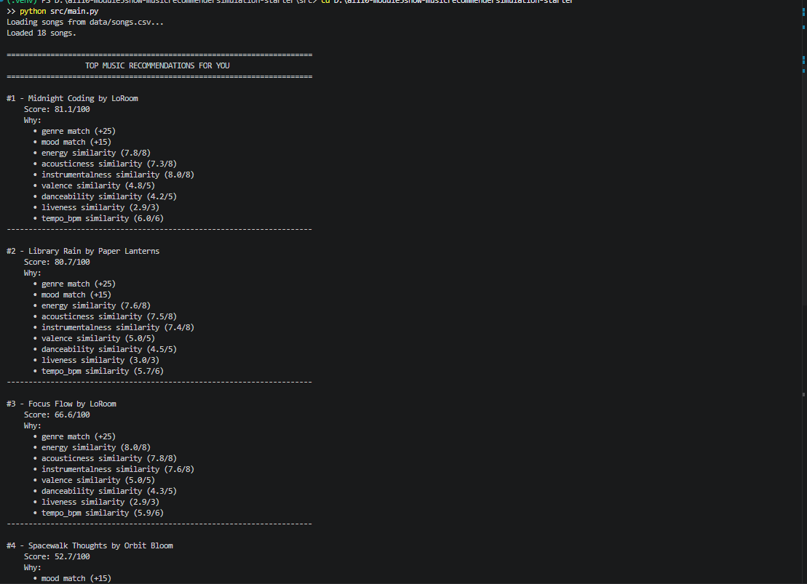
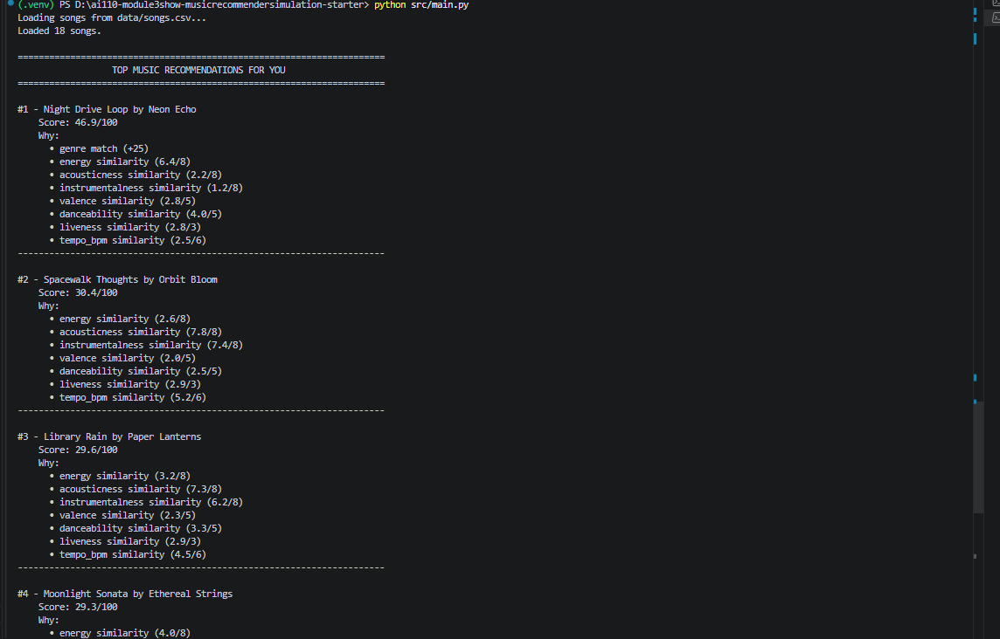
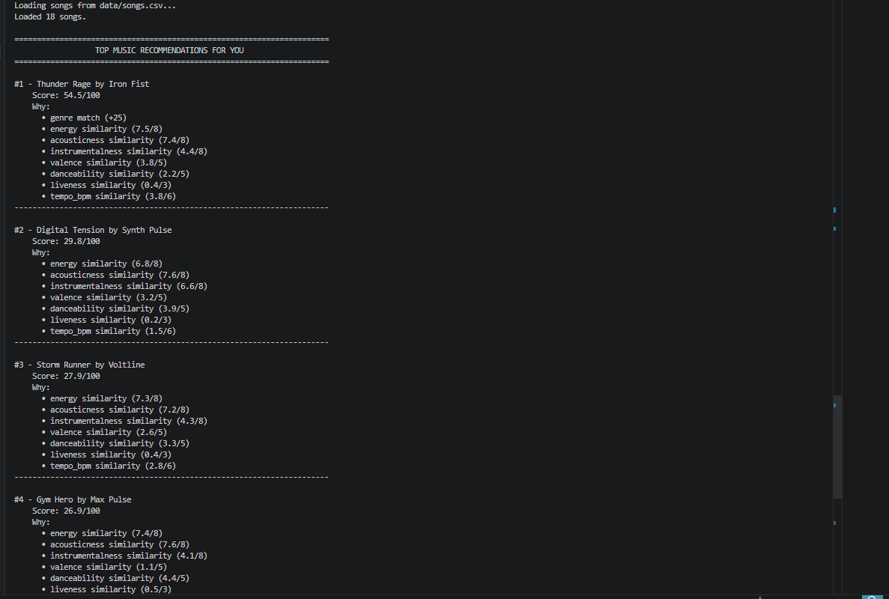
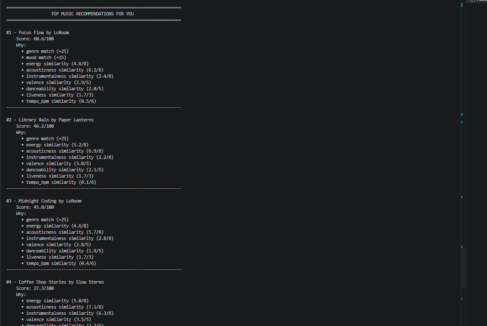

# 🎵 Music Recommender Simulation

## Project Summary

In this project you will build and explain a small music recommender system.

Your goal is to:

- Represent songs and a user "taste profile" as data
- Design a scoring rule that turns that data into recommendations
- Evaluate what your system gets right and wrong
- Reflect on how this mirrors real world AI recommenders

This simulation builds a content-based music recommender. It represents songs as a collection of audio and genre features, builds a user taste profile from preferred genres, moods, and energy levels, then scores every song in the catalog against that profile using a weighted sum. The top-scoring songs become the recommendations.

---

## How The System Works

Real-world music recommenders like Spotify combine two signals: content-based filtering (matching song features to a user's known preferences) and collaborative filtering (surfacing songs enjoyed by similar users), layered with engagement feedback loops. This simulation focuses on the content-based side — scoring every song against a user profile using a transparent weighted sum — prioritizing explainability over black-box complexity.
Some prompts to answer:

- What features does each `Song` use in your system
  - For example: genre, mood, energy, tempo
- What information does your `UserProfile` store
- How does your `Recommender` compute a score for each song
- How do you choose which songs to recommend

You can include a simple diagram or bullet list if helpful.

### Algorithm Recipe (max 100 points)

**Categorical matching:**
- Genre exact match → +25 pts
- Mood exact match → +15 pts

**Numeric similarity** (formula: `1 - |user_value - song_value|`):
- Energy → × 8 pts
- Acousticness → × 8 pts
- Instrumentalness → × 8 pts
- Tempo → × 6 pts (normalized: `(bpm - 60) / 110`)
- Valence → × 5 pts
- Danceability → × 5 pts
- Liveness → × 3 pts

Songs scoring 70–85/100 are considered excellent recommendations.

### Data Flow

Input (User Profile) → Loop over every song in CSV → Score each song → Sort descending → Output Top K

### Expected Biases

- The system may over-prioritize genre (25 pts), causing it to rank a mediocre lofi track above a high-matching jazz or ambient song that fits the mood equally well.
- Songs with rare or unlisted genres/moods will never receive categorical points, systematically underscoring them regardless of how well their audio features match.
- The profile is tuned for one specific user — a different listener (e.g. high-energy pop fan) would get poor results without re-tuning the weights.


---

## Getting Started

### Setup

1. Create a virtual environment (optional but recommended):

   ```bash
   python -m venv .venv
   source .venv/bin/activate      # Mac or Linux
   .venv\Scripts\activate         # Windows

2. Install dependencies

```bash
pip install -r requirements.txt
```

3. Run the app:

```bash
python -m src.main
```

### Running Tests

Run the starter tests with:

```bash
pytest
```

You can add more tests in `tests/test_recommender.py`.

---

## Experiments You Tried

Use this section to document the experiments you ran. For example:

Added two new numerical features suggested by Copilot:

Instrumentalness – measures the likelihood that a track contains no vocals (0.0 = purely vocal, 1.0 = purely instrumental)
Liveness – indicates the probability that a track was recorded in front of a live audience (0.0 = studio recording, 1.0 = live performance)

Refined the user profile based on Copilot critique:
- Lowered `target_danceability` from 0.62 → 0.47 (chill moods resist rhythm-forward music)
- Raised `target_acousticness` from 0.75 → 0.80 (acoustic instruments signal "relaxed" more strongly)
- Lowered `target_liveness` from 0.08 → 0.05 (studio recordings feel more introspective)
These changes create stronger separation between chill lofi and intense rock, while also better distinguishing the profile from ambient/jazz alternatives.


---

## Limitations and Risks

Summarize some limitations of your recommender.

Examples:

- It only works on a tiny catalog
- It does not understand lyrics or language
- It might over favor one genre or mood

You will go deeper on this in your model card.

---

## Reflection

Read and complete `model_card.md`:

[**Model Card**](model_card.md)

Write 1 to 2 paragraphs here about what you learned:

- about how recommenders turn data into predictions
- about where bias or unfairness could show up in systems like this


---

## 7. `model_card_template.md`

Combines reflection and model card framing from the Module 3 guidance. :contentReference[oaicite:2]{index=2}  

```markdown
# 🎧 Model Card - Music Recommender Simulation

## 1. Model Name

Give your recommender a name, for example:

> VibeFinder 1.0

---

## 2. Intended Use

- What is this system trying to do
- Who is it for

Example:

> This model suggests 3 to 5 songs from a small catalog based on a user's preferred genre, mood, and energy level. It is for classroom exploration only, not for real users.

---

## 3. How It Works (Short Explanation)

Describe your scoring logic in plain language.

- What features of each song does it consider
- What information about the user does it use
- How does it turn those into a number

Try to avoid code in this section, treat it like an explanation to a non programmer.

---

## 4. Data

Describe your dataset.

- How many songs are in `data/songs.csv`
- Did you add or remove any songs
- What kinds of genres or moods are represented
- Whose taste does this data mostly reflect

---

## 5. Strengths

Where does your recommender work well

You can think about:
- Situations where the top results "felt right"
- Particular user profiles it served well
- Simplicity or transparency benefits

---

## 6. Limitations and Bias

Where does your recommender struggle

Some prompts:
- Does it ignore some genres or moods
- Does it treat all users as if they have the same taste shape
- Is it biased toward high energy or one genre by default
- How could this be unfair if used in a real product

---

## 7. Evaluation

How did you check your system

Examples:
- You tried multiple user profiles and wrote down whether the results matched your expectations
- You compared your simulation to what a real app like Spotify or YouTube tends to recommend
- You wrote tests for your scoring logic

You do not need a numeric metric, but if you used one, explain what it measures.

---

## 8. Future Work

If you had more time, how would you improve this recommender

Examples:

- Add support for multiple users and "group vibe" recommendations
- Balance diversity of songs instead of always picking the closest match
- Use more features, like tempo ranges or lyric themes

---

## 9. Personal Reflection

A few sentences about what you learned:

- What surprised you about how your system behaved
- How did building this change how you think about real music recommenders
- Where do you think human judgment still matters, even if the model seems "smart"

